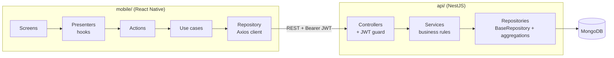
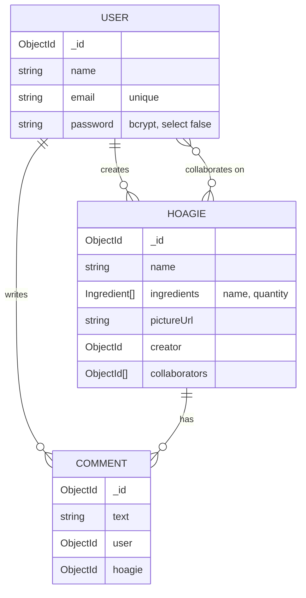

# Hoagie Hub

A collaborative sandwich recipe app. Users build hoagies from a list of ingredients, browse what others have made, comment on recipes, and invite collaborators to edit them together.

The repo holds two apps: a **React Native** mobile client and a **NestJS + MongoDB** REST API.


## Features

- **Authentication.** Email and password sign-up and login. Passwords are hashed with bcrypt and sessions use JWT bearer tokens.
- **Hoagies.** Create, read, update and delete hoagies, each with a name, a list of `{ name, quantity }` ingredients and an optional picture URL.
- **Paginated feed.** Hoagies arrive newest first, with creator details and a live comment count, both resolved in a single MongoDB aggregation pipeline.
- **Comments.** Paginated comment threads per hoagie, plus a comment count endpoint.
- **Collaboration.**
  - The creator can add or remove collaborators.
  - The creator and collaborators can edit a hoagie, but only the creator can delete it.
  - A permissions endpoint tells the client what the current user is allowed to do.
- **Validation.** `class-validator` DTOs run through a global `ValidationPipe` with whitelisting.
- **API docs.** Interactive Swagger UI at `/api`, with bearer auth support.
- **Mobile UX.**
  - Infinite scroll and pull-to-refresh on the feed.
  - A comment list on the detail screen.
  - A create form with a dynamic ingredient list (React Hook Form + Yup).
  - Reanimated entry animations.

## Architecture



**Mobile.** The client is split into layers:

- Screens render the UI.
- Presenters are custom hooks that own the screen state, forms and animations.
- Actions and use cases hold the application logic.
- A repository wraps a shared Axios instance, which attaches the access token to every request.

**API.** Each feature (`auth`, `users`, `hoagies`, `comments`) is a NestJS module. Controllers handle HTTP, Swagger metadata and guards. Services enforce the business rules (ownership and collaborator checks). Repositories extend a generic `BaseRepository<T>` and add aggregation pipelines for joined, paginated reads through a shared `PaginationHelper`.

### Data model



All collections have `createdAt` and `updatedAt` timestamps.

## Tech stack

| Layer | Tools |
| --- | --- |
| Mobile | React Native 0.79, React 19, TypeScript, React Navigation 7 (stack and bottom tabs), React Hook Form, Yup, Reanimated 3, Axios, Vector Icons |
| API | NestJS 10, Mongoose 8, Passport JWT, bcrypt, class-validator and class-transformer, @nestjs/swagger, @nestjs/config |
| Tooling | Jest, ESLint, Prettier, Yarn |

## Project structure

```
.
├── api/                         # NestJS REST API
│   ├── src/
│   │   ├── common/helpers/      # BaseRepository, PaginationHelper
│   │   ├── modules/
│   │   │   ├── auth/            # login/signup, JWT strategy and guard
│   │   │   ├── users/           # user schema and service
│   │   │   ├── hoagies/         # hoagies, collaborators, permissions
│   │   │   └── comments/        # comments and counts
│   │   └── main.ts              # bootstrap, ValidationPipe, Swagger
│   ├── test/                    # e2e test config
│   └── .env.example
└── mobile/                      # React Native app
    ├── App.tsx                  # navigation (stack and tabs)
    ├── src/
    │   ├── screens/             # Login, Hoagies, HoagiesDetail, CreateHogies
    │   ├── presenters/          # screen state hooks
    │   ├── actions/             # UI-facing actions
    │   ├── core/Modules/        # use cases, DTOs, repositories
    │   └── utils/               # Axios instance, session token, colors
    ├── android/
    └── ios/
```

## Getting started

### Prerequisites

- Node.js 18 or later and Yarn 1.x
- A MongoDB instance, either local or Atlas
- A [React Native environment](https://reactnative.dev/docs/set-up-your-environment): Xcode and CocoaPods for iOS, Android Studio for Android

### 1. API

```bash
cd api
yarn install
cp .env.example .env      # then set DATABASE_URL and JWT_SECRET
yarn start:dev
```

The API listens on `http://localhost:3000` (override with `PORT`). Swagger UI is served at `http://localhost:3000/api`.

| Variable | Description |
| --- | --- |
| `DATABASE_URL` | MongoDB connection string |
| `JWT_SECRET` | Secret used to sign access tokens |
| `PORT` | Optional HTTP port, defaults to `3000` |

### 2. Mobile

```bash
cd mobile
yarn install
cd ios && bundle install && bundle exec pod install && cd ..   # iOS only

yarn start        # Metro bundler
yarn ios          # or: yarn android
```

The client calls `http://localhost:3000`, which is set in `mobile/src/utils/axios.ts`. On an Android emulator, change it to `http://10.0.2.2:3000` or run `adb reverse tcp:3000 tcp:3000`.

To create an account, call `POST /auth/signup` from Swagger UI, then log in from the app.

## API reference

Routes marked 🔒 require an `Authorization: Bearer <token>` header.

### Auth

| Method | Route | Description |
| --- | --- | --- |
| `POST` | `/auth/signup` | Register a user and return an access token |
| `POST` | `/auth/login` | Log in and return an access token |

### Hoagies

| Method | Route | Description |
| --- | --- | --- |
| `GET` | `/hoagies?page=&limit=` 🔒 | Paginated feed with creator and comment count |
| `POST` | `/hoagies` 🔒 | Create a hoagie |
| `GET` | `/hoagies/:id` | Hoagie details |
| `PUT` | `/hoagies/:id` 🔒 | Update a hoagie (creator or collaborator) |
| `DELETE` | `/hoagies/:id` 🔒 | Delete a hoagie (creator only) |
| `GET` | `/hoagies/user/:userId` 🔒 | Hoagies created by a user |
| `GET` | `/hoagies/collaborations` 🔒 | Hoagies where the current user collaborates |
| `POST` | `/hoagies/:id/collaborators/:userId` 🔒 | Add a collaborator (creator only) |
| `DELETE` | `/hoagies/:id/collaborators/:userId` 🔒 | Remove a collaborator (creator only) |
| `GET` | `/hoagies/:id/collaborators/count` | Collaborator count |
| `GET` | `/hoagies/:id/permissions` 🔒 | `{ isCreator, isCollaborator }` for the current user |

### Comments

| Method | Route | Description |
| --- | --- | --- |
| `GET` | `/comments/hoagie/:hoagieId?page=&limit=` | Paginated comments for a hoagie |
| `POST` | `/comments` 🔒 | Add a comment |
| `GET` | `/comments/count/hoagie/:hoagieId` | Comment count for a hoagie |

Paginated responses have the form `{ data: T[], meta: { total, page, limit, pages } }`.

## Testing and quality

```bash
# API
cd api
yarn build
yarn test          # unit tests
yarn test:e2e      # e2e tests (needs DATABASE_URL pointing at a running MongoDB)
yarn lint

# Mobile
cd mobile
npx tsc --noEmit   # type check
yarn test          # Jest smoke render of the navigation tree
yarn lint
```

## Screenshots

**Database schema**


**Swagger UI**


## Author

**Andrés Largo**, [@teamzz111](https://github.com/teamzz111)
